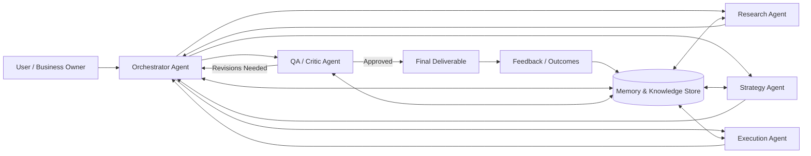

# Multi-Agent AI Operating Model

## 1) What "multiple AI agents" means in your workflow

Instead of one general assistant doing everything in sequence, you use a **team of specialized AI agents**. Each agent has a clear responsibility, shared context, and a handoff protocol. This mirrors how high-performing human teams operate:

- specialists do focused work,
- an orchestrator coordinates timing and dependencies,
- reviewers validate quality before output reaches you.

This structure improves speed, quality, and reliability while reducing context overload in any single agent.

---

## 2) Core agents and responsibilities

### A. Orchestrator Agent
- Receives your objective and constraints (deadline, tone, budget, channels, etc.).
- Breaks the goal into tasks and assigns owners.
- Tracks state (pending/in-progress/done/blocked).
- Decides when to re-run tasks or escalate to you for approvals.

### B. Research Agent
- Collects market, customer, competitor, and trend inputs.
- Produces concise evidence summaries and source confidence levels.
- Flags gaps and unknowns.

### C. Strategy Agent
- Converts research into options and decision frameworks.
- Defines hypotheses, KPIs, risks, and tradeoffs.
- Prioritizes actions based on expected impact and effort.

### D. Execution Agent
- Converts selected strategy into deliverables (plans, copy, specs, tasks, code, or assets).
- Maintains standard templates and formatting conventions.
- Produces implementation-ready outputs.

### E. QA / Critic Agent
- Reviews for consistency, factual alignment, policy compliance, and edge cases.
- Runs structured checks against acceptance criteria.
- Returns either approval or targeted revision requests.

### F. Memory & Knowledge Agent
- Stores reusable decisions, preferences, templates, and prior outcomes.
- Supplies relevant context to all agents to avoid repeated briefing.
- Supports long-term improvement through retrieval and feedback loops.

---

## 3) How they work together (end-to-end)

1. **Goal intake**
   - You provide objective + constraints.
2. **Task decomposition**
   - Orchestrator creates a task graph and delegates subtasks.
3. **Parallel specialist work**
   - Research, strategy, and execution run concurrently where possible.
4. **Synthesis and routing**
   - Orchestrator combines outputs and routes to QA.
5. **Quality gate**
   - QA either approves or sends correction instructions back to specific agents.
6. **Delivery**
   - Final output is returned to you with rationale, assumptions, and next actions.
7. **Learning loop**
   - Memory agent stores outcomes and user feedback to improve future cycles.

---

## 4) Why this helps you achieve your goals faster

- **Speed through parallelization**: independent subtasks execute simultaneously.
- **Higher quality through specialization**: each agent applies a narrower, stronger capability.
- **Better decisions**: strategy is grounded in explicit evidence and QA checks.
- **Lower rework**: quality gates catch gaps before final delivery.
- **Scalability**: the orchestrator can add/remove agents as project complexity changes.
- **Compounding performance**: memory and feedback improve results over time.

---

## 5) Operating safeguards you should keep

- **Clear task contracts** (input schema, output schema, done criteria).
- **Confidence scoring** for research claims.
- **Human-in-the-loop approvals** for high-impact decisions.
- **Audit logs** for traceability (who did what, when, and why).
- **Fallback behavior** when an agent fails (retry, reroute, escalate).

---

## 6) Mermaid architecture diagram

---

## 7) Optional maturity roadmap

- **Phase 1**: Orchestrator + Research + Execution + manual QA.
- **Phase 2**: Add Strategy and automated QA checklists.
- **Phase 3**: Add memory retrieval, performance dashboards, and continuous optimization.

This progression lets you gain value quickly while building a robust multi-agent operating system over time.
